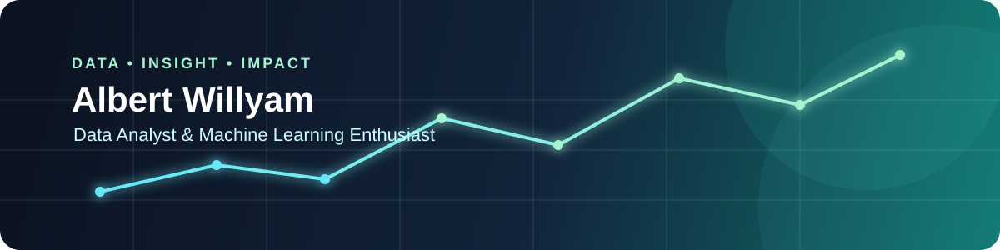

<div align="center">
  
</div>

<h1 align="center">Halo, saya Albert Willyam 👋</h1>

<p align="center">
  <strong>Data Analyst & Machine Learning Enthusiast</strong>
</p>

<p align="center">
  Saya mengolah data menjadi insight yang mudah dipahami dan membangun solusi digital
  yang bermanfaat.
</p>

<p align="center">
  <a href="https://www.linkedin.com/in/albert-willyam">
    
  </a>
  <a href="mailto:albertwillyam84@gmail.com">
    
  </a>
  <a href="https://github.com/albertwillyamzh">
    
  </a>
</p>

## Tentang Saya

- 🎓 Lulusan Informatika dengan minat pada **Data Analytics** dan **Machine Learning**.
- 📊 Terbiasa melakukan pengumpulan, pembersihan, eksplorasi, dan interpretasi data.
- 🧠 Sedang memperdalam pemodelan machine learning dan evaluasi performa model.
- 🛠️ Memiliki pengalaman membangun aplikasi web, mobile, dan produk digital interaktif.
- 🤝 Terbuka untuk peluang kerja entry-level, kolaborasi, dan proyek berbasis data.

## Fokus Saat Ini

```text
Data Analytics       ███████████████████░░   90%
Machine Learning     ████████████████░░░░░   80%
Data Visualization   ███████████████░░░░░░   75%
Web Development      ██████████████░░░░░░░   70%
```

## Teknologi & Tools

<p align="left">
  
</p>

<p align="left">
  
  
  
  
  
  
</p>

## Proyek Unggulan

### 🍌 Klasifikasi Penyakit Daun Pisang

Sistem klasifikasi citra berbasis web menggunakan **Radial Basis Function Neural Network (RBFNN)** untuk mengidentifikasi daun sehat, Sigatoka, Pestalotiopsis, dan Cordana.

- 2.780 citra dengan pembagian data 80:10:10.
- Akurasi pengujian: **85%**.
- mAP: **88,57%**.
- Evaluasi menggunakan confusion matrix, precision, recall, F1-score, heatmap, dan ROC curve.
- Teknologi: Python, Flask, OpenCV, PCA, K-Means, RBFNN, Ridge Regression, dan SQLite.

### 🥗 Nourish.co

Aplikasi web interaktif untuk membantu pengguna memahami kebutuhan nutrisi dan membangun kebiasaan sehat.

- Kalkulator BMI, BMR, TDEE, kalori, dan makronutrisi.
- Habit tracker dan halaman edukasi nutrisi.
- Fitur AI coach dengan fallback response.
- Teknologi: Next.js, TypeScript, React, Tailwind CSS, dan OpenAI API.

🔗 [Lihat repository Nourish.co](https://github.com/albertwillyamzh/nourish.co)

### ✉️ Letters to You

Pengalaman web interaktif berbasis storytelling dengan animasi, musik, kartu pesan, dan alur naratif satu halaman.

- Mengutamakan interaksi, motion design, dan pengalaman pengguna.
- Teknologi: Next.js, TypeScript, React, Framer Motion, dan Tailwind CSS.

🔗 [Lihat repository Letters to You](https://github.com/albertwillyamzh/letterstoyou) · [Live demo](https://letterstoyou.vercel.app)

## Aktivitas GitHub

Saya secara aktif mengembangkan proyek web interaktif, aplikasi berbasis data, dan eksperimen machine learning. Contribution graph bawaan GitHub di bawah profil ini menampilkan aktivitas terbaru saya.

<p align="center">
  <a href="https://github.com/albertwillyamzh?tab=repositories">Lihat semua repository</a>
  &nbsp;·&nbsp;
  <a href="https://github.com/albertwillyamzh?tab=stars">Lihat project yang saya dukung</a>
</p>

## Mari Terhubung

Jika kamu tertarik berdiskusi tentang data, machine learning, pengembangan aplikasi, atau peluang kolaborasi, silakan hubungi saya melalui [LinkedIn](https://www.linkedin.com/in/albert-willyam) atau [email](mailto:albertwillyam84@gmail.com).

---

<p align="center">
  <i>Turning data into insights, and ideas into useful digital products.</i>
</p>
